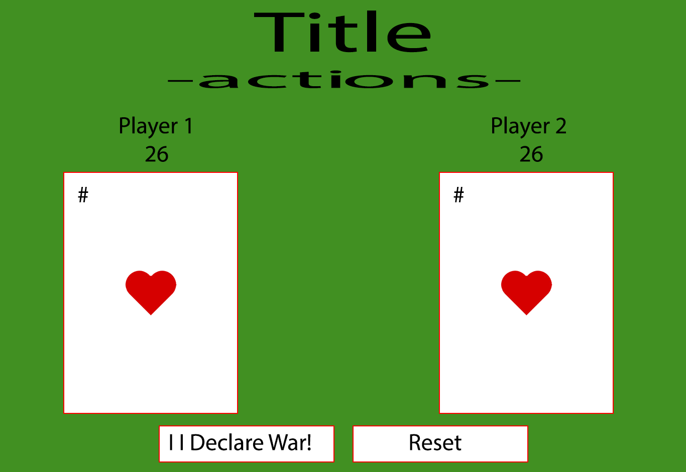

# **War Game!**

A README.md file with these sections:

## Description: 

### Each player turns up a card at the same time and the player with the higher card takes both cards and puts them, face down, on the bottom of his stack. If the cards are the same rank, it is War. Each player turns up one card face down and one card face up. The player with the higher cards takes both piles

## Screenshot:
###War Game Sceenshot

### War Game Wireframe Sceenshot

## Technologies Used: 

### 1. HTML
### 2. CSS
### 3. JavaScript

## Getting Started:

### Click the link to begin playing the game
[War Game](https://davesheinbein.github.io/War-game/) or https://davesheinbein.github.io/War-game/

### Player Choice

#### If playing alone 
##### - You will be player 1

#### If playing with someone else 
##### - The person who clicks Flip! will be Player 1 
##### - While the person who doesn't click Flip! will be Player 2

### Game Play Instructions

##### - Use the Flip! button to begin playing the game
##### - Use the Reset button to reset the game

##### - First to reach 31 cards Wins

#### Good Luck!

## Potential Next Steps: 

### - [x] Add sounds to buttons
### - [x] Add backround music
### - [] Mute button
### - [] Volume slider
### - [] Additional Media Queries 
